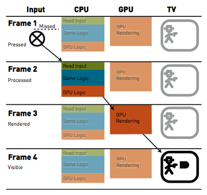
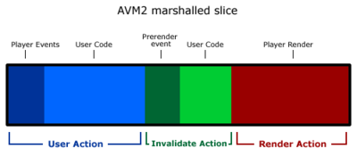

早上看知乎的一个讨论：[为什么认为游戏帧数要到 60 帧每秒才流畅，而大部分电影帧数只有 24 帧每秒？](http://www.zhihu.com/question/21081976)。@Eggpain从程序角度谈到为什么要追求60帧。读了文中链接的文章[Gamasutra - Programming Responsiveness](http://www.gamasutra.com/view/feature/1942/programming_responsiveness.php)。正好可以结合原文，写一点关于游戏中响应延迟的问题。

###游戏流畅性
对于游戏的流畅性，分两部分来看：

1. 画面是否流畅 
2. 操作是否流畅

**画面的流畅性**取决于你游戏的帧频。60帧肯定要比24帧的画面来的流畅，在帧频能够稳定的情况下，高帧频带来的画面效果更好。对于游戏中美术资源的成本来说，60帧可能意味着需要更多的美术资源。

**操作的流畅性**决定了游戏的基本品质！操作流畅性取决于响应延迟的长短。响应延迟就是玩家通过键盘或者鼠标进行了操作，从这个操作的时间点开始直到在游戏画面上反映出该操作效果的时间间隔。那么帧频是如何影响响应时间这个关键因素的呢？60帧和30帧相比较，哪个帧频下操作的流畅性更好？

###为什么会产生响应延迟？
要理解响应延迟就要先了解事件的执行顺序。一般来说游戏的`mainLoop`是这样的：



while (1) 
{
	Input();
	Logic();
	Rendering();
}



`Input()`会处理硬件的输入数据，然后提交给`Logic()`做一些逻辑处理，最后将结果提交给`Rendering()`执行渲染。`Rendering()`包含两部分，一部分是CPU的运算，如筛选渲染列表等操作，最终将要渲染的列表提交到GPU。接下来，我们对照图一来理解：

如图，如果玩家在**Frame1**点击了按钮，那么在**Frame2**中会得到处理，并将结果提交给**Game Logic**,然后结果会到**GPU Logic**。在**GPU Logic**的最后阶段会提交到显卡渲染，但显卡的渲染是异步的。所以**Frame3**会执行渲染，最后在**Frame4**将渲染结果交换到屏幕，呈现给玩家。所以最终，玩家点击按钮的响应延迟时间是**三帧时间的总和**。假如我们的帧频稳定是30fps,那么每帧的时间就是33ms。总的响应延迟时间就是99ms。如果帧频是稳定60fps，那么总的响应延迟时间就是50ms。这个差距还是蛮大的。这还是最理想的情况，如帧频不是特别稳定，那么响应延迟会更加明显一些。

FlashPlayer的执行机制也是类似的：

1. Player事件调度 – 比如Timer事件，鼠标事件，ENTER_FRAME事件，URLLoader事件等等。
2. 用户代码执行 – 所有侦听上一步相应事件的代码被执行。
3. RENDER事件调度 – 在用户代码执行期间调用stage.invalidate()会触发这一特殊事件。
4. 最后的用户代码执行 – 侦听上述第三步特殊事件的用户代码此时被执行。
5. Player更改显示列表。

### 如何处理响应延迟
所以追求高帧频不仅是提高画面表现力，还有就是响应的流畅性。在实际开发中还会有各种各样的问题影响操作的流畅性。

再比如，如果对于游戏物件的位置，旋转，缩放的变化应该是在提交渲染之前完成。不然一样会导致更多的响应延迟。如果一些操作是需要游戏服务器反馈的，网络的好坏也是要影响到响应速度的。

关于如何处理响应延迟就是一个很大的话题了，这个要具体的需求具体处理。但理解了响应延迟产生的原因，可以帮助我们更好的处理响应延迟的问题。
