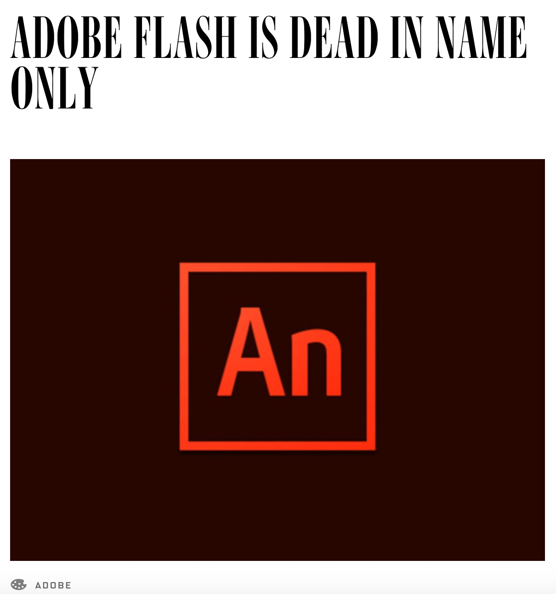
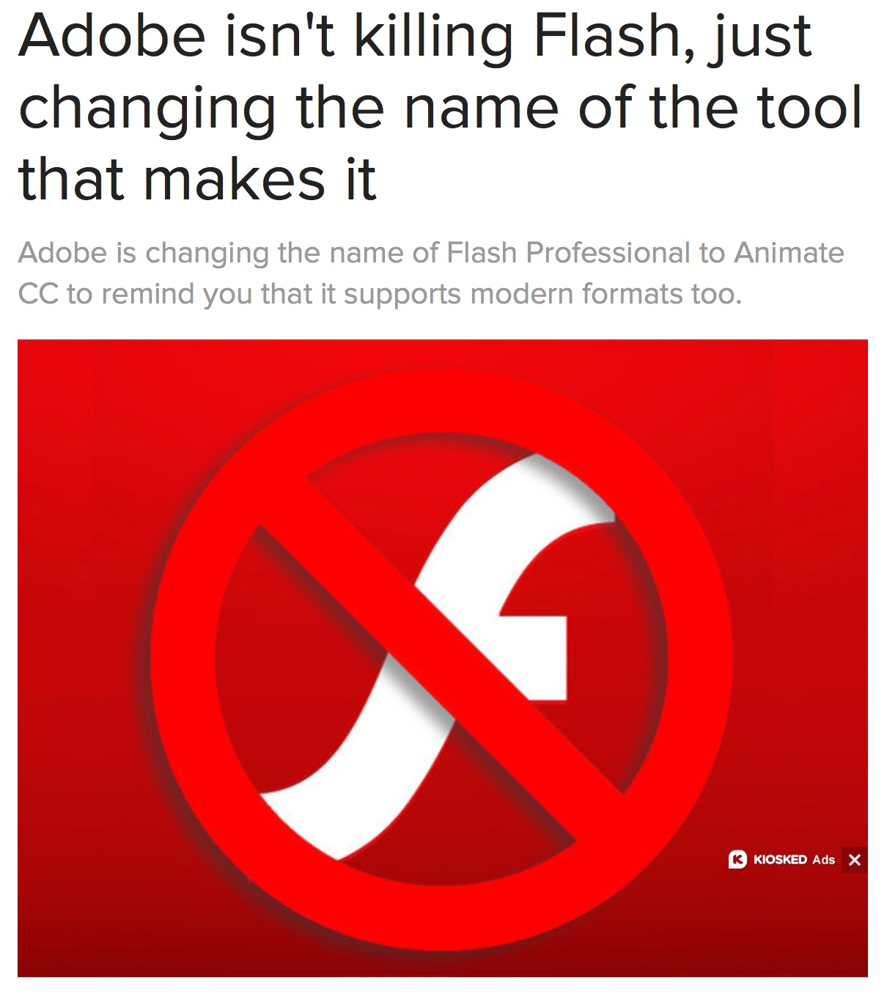
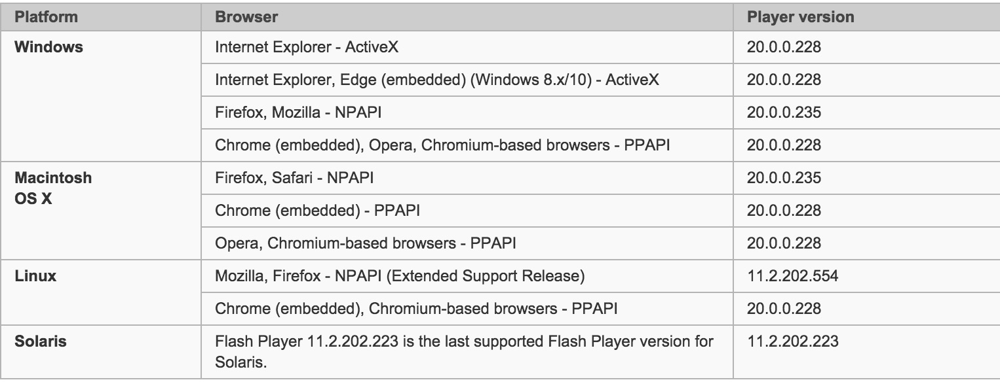

<strong>原创博文，转载请声明</strong>

其实，我越来越倾向“标题党”。文不对题就很容易吸引人。举个例子，阿凡达刚上映不久，网上便流传出下载链接：*最新欧美大片《阿凡达》1080P点击下载*。很多不明真相的网友就点链接，哼哧哼哧的一天25小时不关机，终于把8G的大片下载下来了。打开一看傻眼了，里面竟然播的是**阿凡提的故事**。

比如，今天的文是写FlashPlayer插件PPAPI版本与NPAPI版本相关问题。但如果把标题写成《FlashPlayer的 PPAPI插件与NPAPI插件相关问题》。然后。。。就没然后了。

### Flash 已死

借用国内科技媒体站[oschina](http://www.oschina.net/news/68582/flash-dead)的原话

> “网易科技讯 12月2日消息，据国外媒体报道，Adobe发表声明表示，鼓励开发人员使用新的web标准，比如HTML5， 并停止使用Flash。同时将Flash重新命名为Animate CC，弃用原来的命名Flash Professional CC。”

实际情况是Adobe将原工具**Flash Professional CC**更改为**Animate CC** 。改名的原因当然也只是因为该软件拥有了更强大的功能而已。

再来看国外媒体站：

macworld.com

**标题党都是不负责任的**。

### FlashPlayer 插件版本

统计下最新版本 **FP20**:

可以看到**Chrome**以及**Chromium-based**为核心的浏览器均只有PPAPI架构的FlashPlayer。从Chrome官网更新日志中也可以看到Chrome42以后的版本正式停止NPAPI插件的支持，也就意味着Chrome42以后的版本只能运行PPAPI版本的FlashPlayer。FirFox也在官方正式确认将在2016年年底移除支持NPAPI插件，但仍对Adobe Flash继续提供支持。最新的FireFox里运行的FlashPlayer为Adobe与FireFox合作的定制版，对FlashPlayer插件提供一个**安全保护**模式，用户可自主选择关闭和开启，开启后会影响FlashPlayer运行性能。

### PPAPI与NPAPI

#### NPAPI

维基上的介绍：

> **网景插件应用程序接口**（Netscape Plugin Application Programming Interface,缩写：NPAPI）是一个跨平台的通用浏览器插件应用程序接口。1995年由网景公司发布，应用于网景导航者2.0版本，但其他浏览器很快也跟进支持，成为一个通用的插件标准，与微软的**ActiveX**形成竞争关系。
> 
> 正是由于其跨浏览器的特性，插件库的内容更新及管理一般不是由浏览器而是由各个插件提供商自行维护的。这个特点引发了一些安全性上的疑虑[[\]](https://zh.wikipedia.org/wiki/NPAPI#cite_note-2)，[Google Chrome](https://zh.wikipedia.org/wiki/Google_Chrome)提出了名为PPAPI（Pepper Plugin API）的解决方案[[\]](https://zh.wikipedia.org/wiki/NPAPI#cite_note-3)，但没有得到其它厂商，特别是[Mozilla基金会](https://zh.wikipedia.org/wiki/Mozilla%E5%9F%BA%E9%87%91%E6%9C%83)的普遍支持[[\]](https://zh.wikipedia.org/wiki/NPAPI#cite_note-4)。
> 
> 2014年11月，Google宣布[Chrome](https://zh.wikipedia.org/wiki/Chrome)将于2015年1月默认屏蔽NPAPI插件，9月份会完全移除支持，以鼓励开发者和用户转用[HTML5](https://zh.wikipedia.org/wiki/HTML5)、Chrome API或[Google Native Client](https://zh.wikipedia.org/wiki/Google_Native_Client)等新技术取代NPAPI[[\]](https://zh.wikipedia.org/wiki/NPAPI#cite_note-5)[[\]](https://zh.wikipedia.org/wiki/NPAPI#cite_note-6)。
> 
> 2015年10月，Mozilla也宣布[Firefox](https://zh.wikipedia.org/wiki/Firefox)将于2016年年底移除支持NPAPI插件，但Adobe Flash届时仍会被支持[[\]](https://zh.wikipedia.org/wiki/NPAPI#cite_note-7)。

说白了就是NPAPI的插件存在安全问题，性能差，易崩溃。FlashPlayer从出现开始就一直被吐槽安全问题，性能不高，乔布斯不爱等等问题。但就算如此，NPAPI的性能也比PPAPI要好。见下文。

#### PPAPI

维基上没有中文页，我粗略翻一下：

PPAPI（Pepper Plugin API）是在NPAPI的基础上发展而来的，但PPAPI拥有更多的特性且安全性更高。并且所有插件均允许在安全沙箱中。

Google Chrome, Chromium核心和Opera均已支持PPAPI。

2011年5月21号，Mozilla宣布对PPAPI并不感兴趣(感兴趣才怪)。

### PPAPI vs NPAPI

最后才是重点，我来测测两种FlashPlayer插件的性能吧。在Adobe的bug库中随便找了一条，就用他们的测试Demo来测。[Bug](https://bugbase.adobe.com/index.cfm?event=bug&id=3934097)

硬件（渣电脑）：

> 处理器： AMD Athlon(tm) X4 760K Quad Core Processor 3.79GHz

> 内存： 4.00GB

> 显卡：AMD Radeon HD 6570

> 系统类型： 64位操作系统

| Browser                                  | FlashVersion                      | Time(uploadProgram) |
| ---------------------------------------- | --------------------------------- | ------------------- |
| InternetExplorer8                        | ActiveX-20.0.0.228                | 0-1ms               |
| Chrome 47.0.2526.106                     | PPAPI-20.0.0.228                  | 26-27ms             |
| FireFox 43.0.1                           | NPAPI-20.0r(定制版并开启AdobeFlash保护模式） | 0-1ms               |
| 360安全浏览器(内核版本42.0.2311.152该版本可运行NPAPI以及PPAPI） | PPAPI-19.0.0.226                  | 23-24ms             |
| 360安全浏览器(内核版本42.0.2311.152该版本可运行NPAPI以及PPAPI） | NPAPI-19.0.0.226                  | 0-1ms               |
| 360安全浏览器(内核版本42.0.2311.152该版本可运行NPAPI以及PPAPI） | NPAPI-20.0.0.235                  | 0-1ms               |
| QQ浏览器9.2.1(内核版本45.0.2454.87支持NPAPI以及PPAPI) | NPAPI-20.0.0.235                  | 0-1ms               |
| QQ浏览器9.2.1(内核版本45.0.2454.87支持NPAPI以及PPAPI) | PPAPI-18.0.0.209                  | 26-27ms             |

差不多先测试这么多浏览器吧，可以看到国内的这些山寨浏览器在不管内核高低都没有禁用NPAPI插件，这跟国情还是挺符合的。一大批插件都是基于NPAPI，如果禁用了估计这些山寨浏览器要被吐槽屎了。

我只测试了一个stage3d的接口，可以明显看到PPAPI的调用性能差的不是一点两点。开发者对PPAPI性能问题吐槽也非常多。

另外，**unity3d**挺好用。