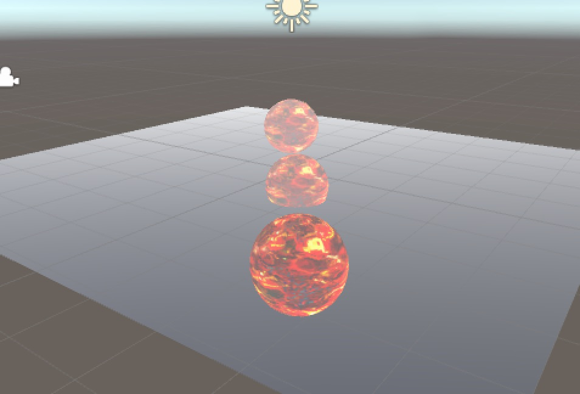

### 雾

先来体会下什么是雾(霾)。


上图据说是北京的某个早晨。最近上海也是各种爆表，那什么blueair的空气净化器都一台难求，各大电商都无货了。

回正题，游戏里对雾的模拟就是根据物体距离摄像机的远近来混合雾和物体本身的颜色。u3d中内置的雾效的渲染有三种模式：**Linear**,**Exponential**,**Exp2** ，三种模式使用不同的公式计算雾的影响因子：

* Linear:
  
  $$
  f = \frac{d{max} - |z|}{d{max} - d{min}}
  $$

dmax受雾影响的最远距离，dmin受雾影响的最小距离，z表示顶点距相机的距离。

* Exponential：
  
  $$
  f = e^{-d|z|}
  $$

d表示雾的浓度，z表示顶点到相机的距离。

* Exp2:
  
  $$
  f = e^{-(dz)^2}
  $$

d表示雾的浓度，z表示顶点到相机的距离。

实现：



代码：

``` c
Shader "Unlit/LinearFog"
{
	Properties
	{
		_fogColor ("Base Color", color) = (1, 1, 1, 1)
		_nearFogDist ("Near Distance", float) = 0
		_farFogDist ("Far Distance", float) = 30
		_fogIntensity("Fog Intensity", float) = 0.5
		_MainTex ("My Texture", 2D) = "white" {}
	}
	SubShader
	{
		
		Tags { "RenderType"="Opaque" }
		Fog { Mode off}
		Pass
		{
			CGPROGRAM
			#pragma vertex vert
			#pragma fragment frag
			
			#include "UnityCG.cginc"
			
			#define mix lerp
			
			struct v2f
			{	
				float4 vertex : SV_POSITION;
				float2 uv_MainTex : TEXCOORD1;
				float4 viewSpacePos : TEXCOORD2;
			};

			float4 _fogColor;
			float _nearFogDist;
			float _farFogDist;
			float _fogIntensity;
			sampler2D _MainTex;
			
			v2f vert (appdata_base v)
			{
				v2f o;
				o.vertex = mul(UNITY_MATRIX_MVP, v.vertex);
				o.uv_MainTex = v.texcoord.xy;
				o.viewSpacePos = mul(UNITY_MATRIX_MV, v.vertex);
				return o;
			}
			
			fixed4 frag (v2f i) : COLOR
			{
				float4 diffuseColor = tex2D(_MainTex, i.uv_MainTex);
				
				i.viewSpacePos.w = 0;
				float dist = length(i.viewSpacePos);
				//linear
//				float fogFactor = (_farFogDist - abs(dist))/(_farFogDist - _nearFogDist);
				//Exponential
				float fogFactor = exp(-abs(_fogIntensity * dist));
				//Exp2
//				float fogFactor = exp(-(_fogIntensity * dist) * (_fogIntensity * dist));
				
				fogFactor = clamp(fogFactor, 0.0, 1.0);
				float3 fogC = mix(_fogColor.rgb, diffuseColor.rgb, fogFactor);
				
				return float4(fogC, diffuseColor.a);
			}
			ENDCG
		}
	}
}

```