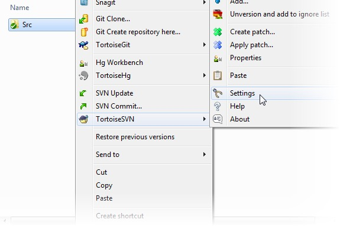
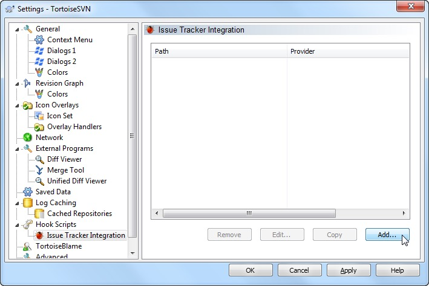
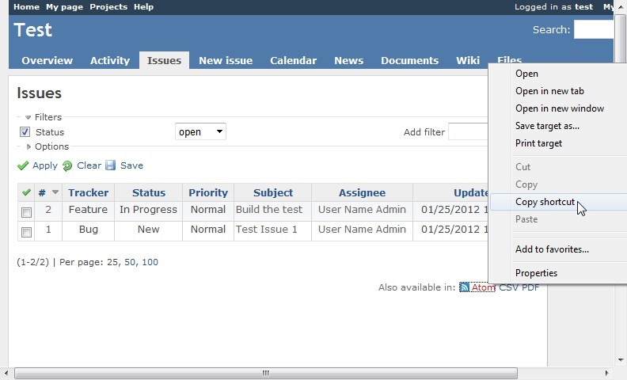
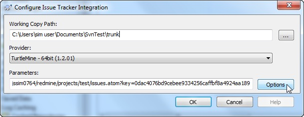
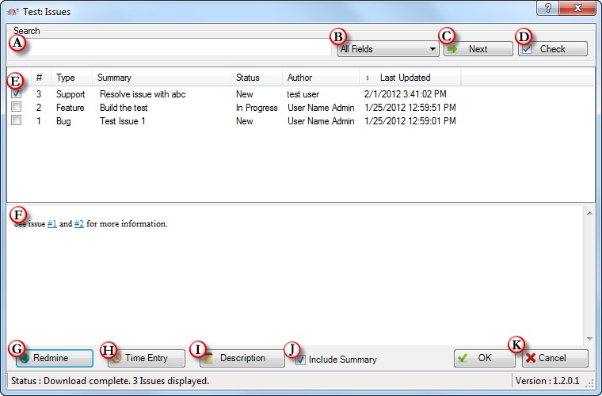

目前项目中bug以及日常功能开发均利用Redmine来进行跟踪管理，要求开发人员每次代码提交必须以Redmine上的一条bug或者功能为整体提交，并在日志中填写对应Redmine上的单号和描述。这么做可以更好的协调分支与主干的代码合并，和任务追踪。但不方便的地方就是每次都要手动从Redmine上来复制单号现的非常繁琐。TurtleMine是TrotoiseSVN的插件，安装后可在TrotoiseSVN中直接拉取到Redmine上的数据，并写入日志。这就方便了很多。

####Install

* 下载对应的安装版本[Downloads](https://code.google.com/archive/p/turtlemine/downloads)
* 确保已安装TortoiseSVN 并建立了项目

#### Configuring

* 在svn资源文件夹下右键进入**Settings**。

* 找到**Issue Tracker Integration** 选项点击**Add**。

* 在接下来的配置界面中需要填写需要跟踪的目录
* 把Redmine上的ATOM Feed配置到Issue List URL
  在Redmine上设置好你的筛选条件，然后在Atom上右键，复制链接。

* 最终设置如下图

* 点击Options后，可以在随后的界面中测试配置是否有效

配置完成。

#### 使用

安装并配置完成后，但你再次提交代码是可以看到界面中多出了**Redmine Issues**按钮。

点击**Redmine Issues**

对话框中的列表是拉取的Redmine上的Feed，只要勾选你代码对应的单号即可。简单方便。

A). 搜索你即将修复的问题

B). 要进行筛选的项

C). 在筛选结果中滚动至下一项

D). 一键勾选符合条件的搜索结果

E). 没什么用

F). 问题的描述

G). 在浏览器中打开该问题

H). 在浏览器中打开该问题的time Entry页面

I). 显示/隐藏 问题描述

J). 如果选中该选项那么问题描述也将写入到日志中

K). 无需解释

最终：

