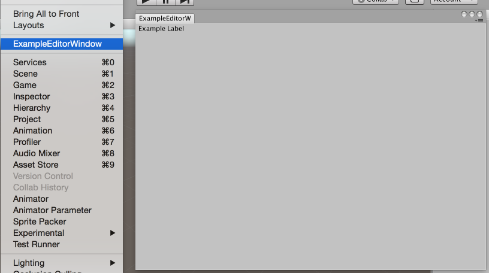
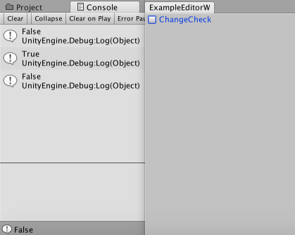
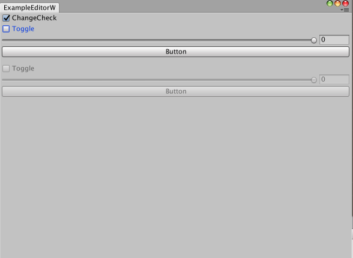
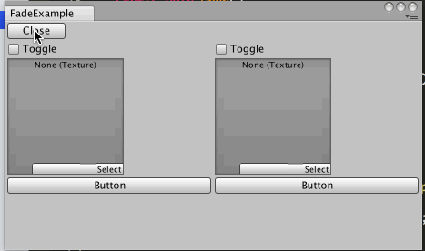
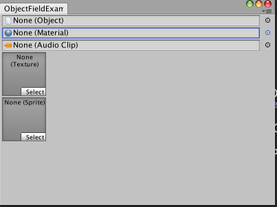
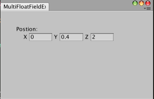
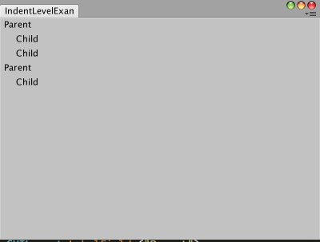
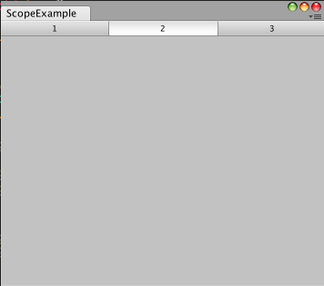

## 新建插件

u3d会自动识别Assets中的Editor目录，该目录中的脚步文件均可使用**UnityEditor**命名空间下的API。识别该目录为插件目录。

目录结构比较随意：

* Assets / Editor
* Assets/MyFolder/Scripts/Editor
* Assets/Standard Assets/Editor

我们使用**Assets/EditorGuide/Editor**目录组织和编写插件。

## EditorWindow



```c#
using UnityEngine;
using UnityEditor;

public class ExampleEditorWindow : EditorWindow {
	//在window菜单栏添加ExampleEditorWindow子菜单
	[MenuItem("Window/ExampleEditorWindow")]
	static void Open(){
		GetWindow<ExampleEditorWindow> ();	
	}

	void OnGUI()
	{
		EditorGUILayout.LabelField ("Example Label");
	}
}

```

## ChangeCheck



```c#
using UnityEngine;
using UnityEditor;

public class ExampleEditorWindow : EditorWindow {
	// 在window菜单中添加ExampleEditorWindow子菜单
	[MenuItem("Window/ExampleEditorWindow")]
	static void Open(){
		GetWindow<ExampleEditorWindow> ();	
	}

	bool toggleValue;

	void OnGUI()
	{
		// ChangeCheck example
		EditorGUI.BeginChangeCheck ();
		toggleValue = EditorGUILayout.ToggleLeft ("ChangeCheck", toggleValue);

		if (EditorGUI.EndChangeCheck ()) {
			Debug.Log (toggleValue);
		}
		// End ChangeCheck example
	}
}

```

## DisabledGroup



```c#
using UnityEngine;
using UnityEditor;
[ExecuteInEditMode]
public class ExampleEditorWindow : EditorWindow {
	// 在window菜单中添加ExampleEditorWindow子菜单
	[MenuItem("Window/ExampleEditorWindow")]
	static void Open(){
		GetWindow<ExampleEditorWindow> ();	
	}

	bool toggleValue;

	void OnGUI()
	{
//		EditorGUILayout.LabelField ("Example Label");

		// ChangeCheck example
		EditorGUI.BeginChangeCheck ();
		toggleValue = EditorGUILayout.ToggleLeft ("ChangeCheck", toggleValue);

		if (EditorGUI.EndChangeCheck ()) {
			Debug.Log (toggleValue);
		}
		// End ChangeCheck example

		// DisabledGroup example
		AddComp();

		EditorGUILayout.Space ();

		EditorGUI.BeginDisabledGroup (true);

		AddComp ();

		EditorGUI.EndDisabledGroup ();
		//End DisableGroup example
	}

	void AddComp()
	{
		EditorGUILayout.ToggleLeft ("Toggle", false);
		EditorGUILayout.IntSlider (0, 10, 0);
		GUILayout.Button ("Button");
	}

}

```

**使用GUI.enabled可得到同样的效果**

## FadeGroup



```c#
using System.Collections;
using System.Collections.Generic;
using UnityEngine;
using UnityEditor;
using UnityEditor.AnimatedValues;
using UnityEngine.Events;

[ExecuteInEditMode]
public class FadeExample : EditorWindow {

	[MenuItem("Window/FadeExample")]

	static void Open()
	{
		GetWindow<FadeExample> ();
	}

	AnimFloat animFloat = new AnimFloat(0.0001f);
	Texture tex;

	void OnGUI()
	{
		bool on = animFloat.value == 1;

		if (GUILayout.Button (on ? "Close" : "Open", GUILayout.Width (64)))
		{
			animFloat.target = on ? 0.0001f : 1;
			animFloat.speed = 0.5f;

			var unityEvent = new UnityEvent ();
			unityEvent.AddListener (() => Repaint());
			animFloat.valueChanged = unityEvent;
		}

		EditorGUILayout.BeginHorizontal ();
		EditorGUILayout.BeginFadeGroup (animFloat.value);
		AddComp ();
		EditorGUILayout.EndFadeGroup ();
		AddComp ();
		EditorGUILayout.EndHorizontal ();
	}

	void AddComp()
	{
		EditorGUILayout.BeginVertical ();
		EditorGUILayout.ToggleLeft ("Toggle", false);

		var options = new []{GUILayout.Width(128), GUILayout.Height(128) };
		tex = EditorGUILayout.ObjectField (tex, typeof(Texture), false, options) as Texture;

		GUILayout.Button ("Button");
		EditorGUILayout.EndVertical ();
	}

}

```

## EditorGUI.ObjectField



```c#
using UnityEngine;
using UnityEditor;

[ExecuteInEditMode]
public class ObjectFieldExample : EditorWindow
{
	[MenuItem("Window/ObjectFieldExample")]
	static void Open()
	{
		GetWindow<ObjectFieldExample> ();
	}

	void OnGUI()
	{
		EditorGUILayout.ObjectField (null, typeof(Object), false);
		EditorGUILayout.ObjectField (null, typeof(Material), false);
		EditorGUILayout.ObjectField (null, typeof(AudioClip), false);

		var options = new []{GUILayout.Width(64), GUILayout.Height(64) };
		EditorGUILayout.ObjectField (null, typeof(Texture), false, options);
		EditorGUILayout.ObjectField (null, typeof(Sprite), false, options);
	}

}
```

## EditorGUI.MultiFloatField



```c#
using UnityEngine;
using UnityEditor;

[ExecuteInEditMode]
public class MultiFloatFieldExample : EditorWindow
{

	[MenuItem("Window/MultExample")]
	static void Open()
	{
		GetWindow<MultiFloatFieldExample> ();
	}

	float[] numbers = new float[] {
		0,
		1,
		2
	};

	GUIContent[] contents = new GUIContent[] {
		new GUIContent ("X"),
		new GUIContent ("Y"),
		new GUIContent ("Z")
	};

	void OnGUI()
	{
		EditorGUI.MultiFloatField (new Rect (30, 30, 200, EditorGUIUtility.singleLineHeight),
			new GUIContent ("Postion:"),
			contents,
			numbers);
	}
}
```

## EditorGUI.IndentLevel



```c#
using UnityEngine;
using UnityEditor;

[ExecuteInEditMode]
public class IndentLevelExample : EditorWindow
{
	[MenuItem("Window/IndentLevelExample")]
	static void Open()
	{
		GetWindow<IndentLevelExample> ();
	}

	void OnGUI()
	{
		EditorGUILayout.LabelField ("Parent");
		EditorGUI.indentLevel++;

		EditorGUILayout.LabelField ("Child");
		EditorGUILayout.LabelField ("Child");

		EditorGUI.indentLevel--;
		EditorGUILayout.LabelField ("Parent");

		EditorGUI.indentLevel++;
		EditorGUILayout.LabelField ("Child");
	}

}
```

## EditorGUILayout.Knob


```c#
using UnityEngine;
using UnityEditor;

[ExecuteInEditMode]
public class KnobExample : EditorWindow
{
	[MenuItem("Window/KnobExample")]

	static void Open()
	{
		GetWindow<KnobExample> ();
	}

	float angle = 0;
	void OnGUI()
	{
		angle = EditorGUILayout.Knob (Vector2.one * 64, angle, 0, 360, "°", Color.gray, Color.red, true);
	}
}
```

## Scope

前面的例子我有使用布局函数来对组件进行布局，如调用**BeginHorizontal**函数开始布局，然后添加组件，最后调用**EndHorizontal**来完成布局。我们也可以使用**HorizontalScope**,**VerticalScope**,**ScrollViewScope**来完成布局。

```c#
using UnityEngine;
using UnityEditor;

[ExecuteInEditMode]

public class ScopeExample : EditorWindow
{
	[MenuItem("Window/ScopeExample")]
	static void Open()
	{
		GetWindow<ScopeExample> ();
	}

	void OnGUI()
	{
		using (new EditorGUILayout.HorizontalScope ()) 
		{
			GUILayout.Button ("Button1");
			GUILayout.Button ("Button2");
		}
	}
}
```


还可以自定义Scope，我们这里新建一个**BackgroundColorScope**。

```c#
using UnityEngine;
using UnityEditor;


public class BackgroundColorScope : EditorGUILayout.HorizontalScope
{

	private readonly Color color;

	public BackgroundColorScope(Color color)
	{
		this.color = GUI.backgroundColor;
		GUI.backgroundColor = color;
	}

	protected override void CloseScope()
	{
		GUI.backgroundColor = color;
	}
}
```


## Toggle Button


```c#
using UnityEngine;
using UnityEditor;

[ExecuteInEditMode]

public class ScopeExample : EditorWindow
{
	[MenuItem("Window/ScopeExample")]
	static void Open()
	{
		GetWindow<ScopeExample> ();
	}

	bool one, two, three;
	void OnGUI()
	{

		using (new EditorGUILayout.HorizontalScope ()) {
			one = GUILayout.Toggle (one, "1", EditorStyles.miniButtonLeft);
			two = GUILayout.Toggle (two, "2", EditorStyles.miniButtonMid);
			three = GUILayout.Toggle (three, "3", EditorStyles.miniButtonRight);
		}

	}
}
```

上面的togglebutton是互不相关的按钮，如果想做一组类似标签页的按钮的话可以使用**GUILayout.Toolbar**来实现。

```c#
int selected;
void OnGUI()
{
	selected = GUILayout.Toolbar (selected, new string[]{ "1", "2", "3" });  
}
```

还可以给toolbar中的togglebutton设置按钮样式。



```c#
int selected;

void OnGUI ()
{
  selected = GUILayout.Toolbar (selected,
      new string[]{ "1", "2", "3" }, EditorStyles.toolbarButton);
}
```

