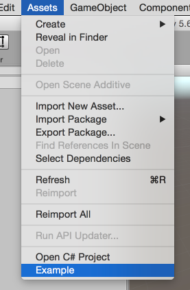
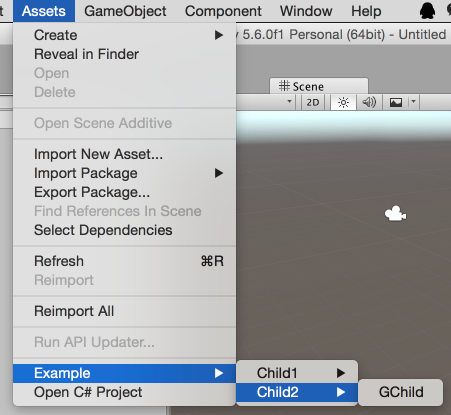
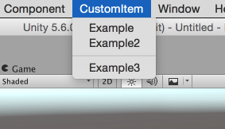

## 自定义菜单


```c#
using UnityEditor;
using UnityEngine;

public class MenuItemExample{
	[MenuItem("CustomMenu/Example")]
	static void CustomExample()
	{
		Debug.Log ("CustomExample>>>>");
	}
}
```

自定义个菜单就是这么简单。

如果想给已存在的菜单栏创建子菜单：

```c#
using UnityEditor;
using UnityEngine;

public class MenuItemExample{
	[MenuItem("Assets/Example")]
	static void CustomExample()
	{
		Debug.Log ("CustomExample>>>>");
	}
}
```



如果想给子菜单添加菜单项：

```c#
using UnityEditor;
using UnityEngine;

public class MenuItemExample{
	[MenuItem("Assets/Example/Child1/GChild")]
	static void CustomExample()
	{
		Debug.Log ("CustomExample>>>>");
	}

	[MenuItem("Assets/Example/Child2/GChild")]
	static void GChild()
	{
		Debug.Log ("GChild");
	}
}
```



## 改变自定义菜单栏顺序


```c#
using UnityEditor;
using UnityEngine;

public class MenuItemExample{
	[MenuItem("Assets/Example/Child1/GChild", false, 1)]
	static void CustomExample()
	{
		Debug.Log ("CustomExample>>>>");
	}

	[MenuItem("Assets/Example/Child2/GChild")]
	static void GChild()
	{
		Debug.Log ("GChild");
	}


}
```

priority可设置为任意数字，数字越大排序越靠后。如果设置的priority值与上一个priority相差值大于等于11会自动在两个菜单栏中间加分隔线(好神奇的规则)。



```c#
using UnityEditor;
using UnityEngine;

public class MenuItemExample{
	[MenuItem("CustomItem/Example", false,1)]
	static void CustomExample()
	{
		Debug.Log ("CustomExample>>>>");
	}

	[MenuItem("CustomItem/Example2", false, 1)]
	static void GChild()
	{
		Debug.Log ("GChild");
	}

	[MenuItem("CustomItem/Example3", false, 12)]
	static void GChild2()
	{
		
	}
}
```

### 绑定快捷键

下面例子为Example菜单绑定了快捷键：Ctrl(Windows)/Command(MacOSX)+Shift+g

```c#
[MenuItem("CustomMenu/Example %#g")]
    static void Example ()
    {
        Debug.Log ("Example>>>>");
    }
```

注意绑定的快捷键要与菜单用空格分隔开。

|   字符    |               键               |
| :-----: | :---------------------------: |
|    %    | Ctrl(Windows)/Command(MacOSX) |
|    #    |             Shift             |
|    &    |  Alt(Windows)/Option(MacOSX)  |
|    -    |               无               |
| F1…F12  |         function key          |
|  HOME   |           Home key            |
|   END   |            End key            |
|  PGUP   |          PageUp key           |
|  PGDN   |         PageDown key          |
| KP0…KP9 |           小键盘数字0-9            |
|   KP.   |               .               |
|   KP+   |               +               |
|   KP-   |               -               |
|   KP*   |               *               |
|   KP/   |               /               |
|   KP=   |               =               |

### CONTEXT


```c#
using UnityEditor;

public class ContextExample
{
	[MenuItem("CONTEXT/Transform/Example1")]
	static void Example1(){}

	[MenuItem("CONTEXT/Component/Example2")]
	static void Example2(){}

	[MenuItem("CONTEXT/ExampleScript/Example3")]
	static void Example3(){}
}
```

### MenuCommand


```c#
using UnityEditor;
using UnityEngine;

public class ContextExample
{
	[MenuItem("CONTEXT/Transform/Example1")]
	static void Example1(MenuCommand menuCommand)
	{
		Debug.Log (menuCommand.context);
	}

	[MenuItem("CONTEXT/Component/Example2")]
	static void Example2(){}

	[MenuItem("CONTEXT/ExampleScript/Example3")]
	static void Example3(){}
}
```

