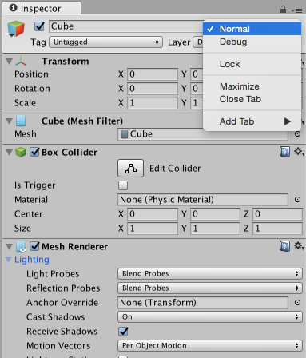
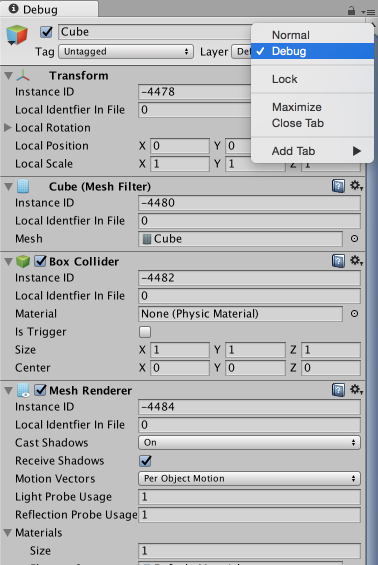
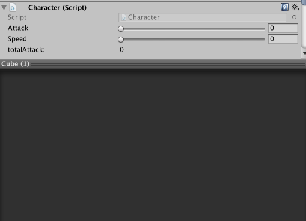
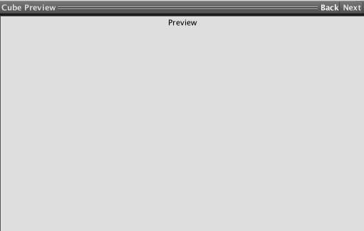
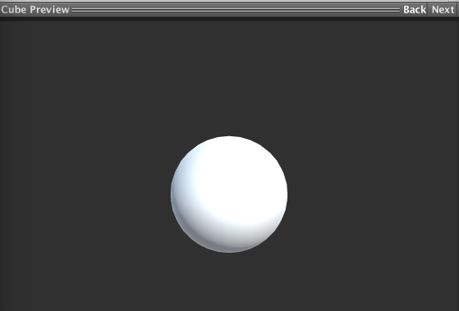

<span style="color: #ff6600;"><strong>原创博文，转载请声明</strong></span>

## Inspector的Debug模式





debug模式下会展示更多参数。我们可以自定义Inspector中的编辑面板。

## Object & Editor class


Unity内置了很多编辑面板供使用：TransformInspector, BoxColliderInspector,MeshRendererInspector等。

## 自定义CustomEditor

```c#
using UnityEngine;

public class Character : MonoBehaviour
{
	[Range(0, 255)]
	public int attack;

	[Range(0, 99)]
	public int speed;

	public int totalAttack{
		get {
			return attack * speed;
		}
	}
}
```

我们将新建的脚步绑定到场景中的Cube上，然后在Inspector面板就可以看到下面的面板。


那么如果我想将属性totalAttack也显示在Inspector面板，该如何做呢？

```c#
using UnityEngine;
using UnityEditor;

[CustomEditor (typeof(Character))]
public class CharacterInspector : Editor {
	Character character = null;

	public override void OnInspectorGUI()
	{
		character = (Character)target;
		base.OnInspectorGUI ();

		EditorGUILayout.LabelField ("totalAttack: ", character.totalAttack.ToString());
	}
}
```


## CanEditMultipleObjects

在编辑器中同时选中多个GameObject是可以同时编辑多个GameObject相同属性的。如下图：


回到上面我们自定义的：


我们可以通过设置**CanEditMultipleObjects**来提供支持。

```c#
using UnityEngine;
using UnityEditor;

[CanEditMultipleObjects]
[CustomEditor (typeof(Character))]
public class CharacterInspector : Editor {
	Character character = null;

	public override void OnInspectorGUI()
	{
		character = (Character)target;
		base.OnInspectorGUI ();

		EditorGUILayout.LabelField ("totalAttack: ", character.totalAttack.ToString());
	}
}
```


## Preview

在Inspector中可使用preview window对Mesh, Texture,Sprite进行预览。

```c#
using UnityEngine;
using UnityEditor;

[CanEditMultipleObjects]
[CustomEditor (typeof(Character))]
public class CharacterInspector : Editor {
	Character character = null;

	public override void OnInspectorGUI()
	{
		character = (Character)target;
		base.OnInspectorGUI ();

		EditorGUILayout.LabelField ("totalAttack: ", character.totalAttack.ToString());
	}

	public override bool HasPreviewGUI()
	{
		return true;
	}
}
```

复写**HasPreviewGUI**方法，并返回**true**，就可以启用**Preview Window**了。



### GetPreviewTitle

通过**GetPreviewTile**可设置Preview的标题。

```c#
public override GUIContent GetPreviewTitle()
{
	return new GUIContent ("Cube Preview");
}
```


### OnPreviewSettings

```c#
public override void OnPreviewSettings()
{
  GUIStyle preLabel = new GUIStyle ("preLabel");
  GUIStyle preButton = new GUIStyle ("preButton");

  GUILayout.Label ("Back", preLabel);
  GUILayout.Button ("Next", preButton);
}
```


### OnPreviewGUI

我们最终要呈现的东西就是要在该阶段处理。我们这里先放一个Box进去。



```c#
public override void OnPreviewGUI(Rect r, GUIStyle background)
{
	GUI.Box (r, "Preview");
}
```

## 在Preview Window中使用Camera

接下来，我们将要监视的对象，绘制到Preview Window。



```c#
using UnityEngine;
using UnityEditor;

[CanEditMultipleObjects]
[CustomEditor (typeof(Character))]
public class CharacterInspector : Editor {
	Character character = null;

	PreviewRenderUtility previewRenderUtility;
	GameObject previewObject;

	void OnEnable()
	{
		previewRenderUtility = new PreviewRenderUtility (true);
		previewRenderUtility.m_CameraFieldOfView = 30f;
		previewRenderUtility.m_Camera.nearClipPlane = 0.3f;
		previewRenderUtility.m_Camera.farClipPlane = 1000;

		var component = (Component)target;
		previewObject = component.gameObject;
	}
		
	public override void OnInspectorGUI()
	{
		character = (Character)target;
		base.OnInspectorGUI ();

		EditorGUILayout.LabelField ("totalAttack: ", character.totalAttack.ToString());
	}

	public override bool HasPreviewGUI()
	{
		return true;
	}

	public override GUIContent GetPreviewTitle()
	{
		return new GUIContent ("Cube Preview");
	}

	public override void OnPreviewSettings()
	{
		GUIStyle preLabel = new GUIStyle ("preLabel");
		GUIStyle preButton = new GUIStyle ("preButton");

		GUILayout.Label ("Back", preLabel);
		GUILayout.Button ("Next", preButton);
	}

	public override void OnPreviewGUI(Rect r, GUIStyle background)
	{
		previewRenderUtility.BeginPreview (r, background);
		var previewCamera = previewRenderUtility.m_Camera;

		previewCamera.transform.position = previewObject.transform.position + new Vector3 (0, 2.5f, -5);

		previewCamera.transform.LookAt (previewObject.transform);
		previewCamera.Render ();
		previewRenderUtility.EndAndDrawPreview (r);
	}
}
```

