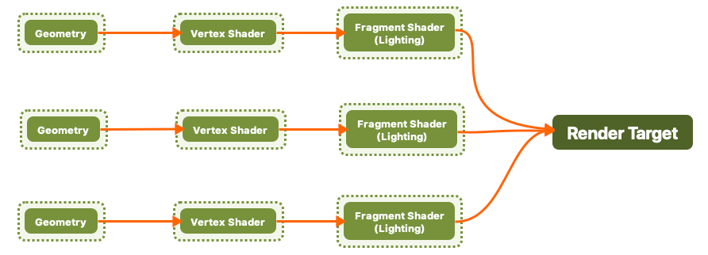
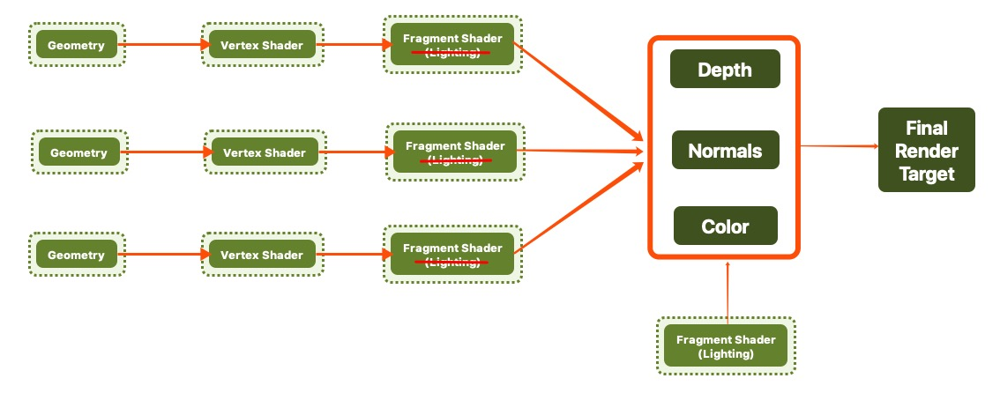

### Unity中的渲染路径

在SRP之前，Unity提供了**Forward**和**Deferred**两种主流的**Render Path**。实际开发中，使用**Standard Shader**基本可以满足大部分需求，也可以使用**Custom Shader**来对**Standard Shader**进行扩展。如果有定制的渲染需求，还可使用**Command Buffer**来扩展现有的管线。

大部分情况下，我们只能为项目选择一种渲染路径。Unity默认情况下是**Forward Rendering Path**。但是，可为多个摄像机配置不同的**Rendering Path**。

#### Forward Rendering



上图只是大致的描述**Forward**的原理，在Unity中**Lighting**可以不在**Fragment Shader**阶段，这里不展开讨论。**Forward Rendering**中的**Lighting**和受光照影响的物体个数是成正比的，也就是**受光照影响的物体*灯光数**，一个物体受多个光影响的情况下，会多次计算光照从而得出最终颜色。

#### Deferred Rendering

**Deferred Rendering**中**Lighting**与受光照影响的物体无关，只与最终屏幕大小相关，也就是 **最终屏幕分辨率*灯光数**。

**Deferred Rendering**需要先将必要的信息渲染至**Color Buffer**,**Depth Buffer**,**Normals Buffer**,然后在最后执行**Lighting**。这要求显卡支持**MRT(multiple render targets)**。

​								Color Buffer, Depth Buffer, Normal buffer

#### 使用Deferred Rendering注意事项

* 要求显卡支持MRT，老旧的显卡可能不支持。会有兼容性问题。
* 要求显卡高带宽，老旧显卡可能存在问题。会有兼容性问题。
* 无法处理透明物体渲染（除非Forward和Deferred混合使用，使用Forward处理透明物体）。
* 有些基于Deferred Rendering的引擎无法支持抗锯齿，但其实可通过**Edge detection(边缘检测)**或**FXAA(Fast Approximate Anti-Aliasing 快速近似抗锯齿)**来处理。
* 只支持单材质，除非使用[**Deferred Lighting**](https://zh.wikipedia.org/wiki/延迟着色)。

### Unity中的可编程管线

unity的SRP(Scriptable Render Pipeline)允许开发者使用C#控制Unity的渲染流程。在最新的Unity版本中还提供了两种渲染管线：

1. Lightweight Pipeline 兼容各种硬件平台，基于Forward Rendering。
2. HD Pipeline 面向主机和PC平台，支持Forward Rendering 和 Deferred Rendering
3. 自定义SRP 可实现自定义渲染管线

下一篇：

​	1.实现自己的渲染管线

> 参考：
>
> [Forward Rendering vs. Deferred Rendering](https://gamedevelopment.tutsplus.com/articles/forward-rendering-vs-deferred-rendering--gamedev-12342)

