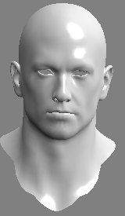
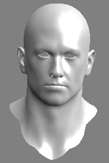
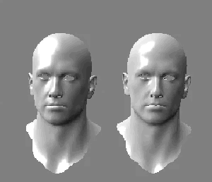

#### 高光反射

当一个光滑物体被光照射时，可以在某个方向上看到很强的反射光，这是因为在接近镜面反射角的一个区域内，反射了入射光的全部或绝大部分光强，该现象称为镜面反射。高光反射即用来模拟该现象。

**Phong Bui Tuong**提出了计算镜面反射的经验模型，称为**Phong模型**，镜面反射的光强与反射光线和视线的夹角相关：


$$
c_{specular} = (c_{light} \ast m_{specular})\ast max(0, v \cdot r)^{m_{glass}}
$$
$v$ : 视角方向

$l$ : 光源方向  

$r$ : 反射方向 $r = 2(n \cdot l) - l$

$m_{glass} $ : 材质光泽度（gloss）或者反光度 （shininess） 值越大亮点越小 

$m_{specular}$ : 材质高光发射颜色，控制材质对于高光反射的强度和颜色  


#### 实现

##### Phong模型



```c#
// Upgrade NOTE: replaced '_Object2World' with 'unity_ObjectToWorld'

Shader "Dev/Specular_Pixel"
{
    Properties
    {
        _Diffuse ("Diffuse", Color) = (1, 1, 1, 1)
        _Specular ("Specular", Color) = (1, 1, 1, 1)
        _Gloss ("Gloss", Range(5.0, 256.0)) = 20
        _MainTex("Texture", 2D) =  "white" {}
    }

    SubShader
    {
        Tags { "RenderType" = "Opaque" "Queue" = "Geometry" "LightMode" = "BasicLightMode" }

        Pass
        {
            CGPROGRAM
            #pragma vertex vert
            #pragma fragment frag

            #include "UnityCG.cginc"
            #include "Lighting.cginc"

            struct a2v
            {
                float4 vertex : POSITION;
                float2 uv : TEXCOORD0;
                float3 normal : NORMAL;
            };

            struct v2f
            {
                float4 pos : SV_POSITION;
                float2 uv : TEXCOORD0;
                float3 worldNormal : TEXCOORD1;
                float3 worldPos : TEXCOORD2;
            };

            fixed4 _Diffuse;
            fixed4 _Specular;
            float _Gloss;
            sampler2D _MainTex;
            float4 _MainTex_ST;

            v2f vert (a2v v)
            {
                v2f o;
                o.pos = UnityObjectToClipPos(v.vertex);
                o.uv = TRANSFORM_TEX(v.uv, _MainTex);
                o.worldNormal = normalize(mul(v.normal, (float3x3)unity_WorldToObject));
                o.worldPos = mul(unity_ObjectToWorld, v.vertex).xyz;
                return o;
            }

            fixed4 frag(v2f i) : SV_TARGET
            {
                //Diffuse
                fixed3 worldLight = normalize(_WorldSpaceLightPos0.xyz);
                // fixed3 diffuse = _LightColor0.rgb * _Diffuse.rgb * saturate(dot(i.worldNormal, worldLight));
                fixed3 diffuse = _LightColor0.rgb * _Diffuse.rgb * (dot(i.worldNormal, worldLight)*0.5 + 0.5);
                //Specular
                fixed3 reflectDir = normalize(reflect(-worldLight, i.worldNormal));
                fixed3 viewDir = normalize(_WorldSpaceCameraPos.xyz - i.worldPos.xyz);
                fixed3 specular = _LightColor0.rgb * _Specular.rgb * pow(saturate(dot(reflectDir, viewDir)), _Gloss);

                fixed3 color = unity_AmbientSky + diffuse + specular;
                fixed4 v_color = tex2D(_MainTex, i.uv);
                fixed4 f_color = fixed4(color, 1.0);
                return v_color * f_color;
            }

            ENDCG
        }
    }
}
```

##### Blinn-Phong 光照模型

**Blinn-Phone**光照模型又称**Blinn-Phong**反射模型或者**Phong**修正模型。是由**Jim Blinn**于1977年在文章“Models of light reflection for computer synthesized pictures”中对传统**Phong**光照模型基础上进行修改提出的。**Blinn-Phong**模型的渲染效果更柔和，更平滑。另外，因为将**Phong**模型中的反射光方向的计算替换为半角向量（光入射方向与视点方向的中间向量）的计算，故性能优与**Phong**模型：
$$
c_{specular} = (c_{light} \ast m_{specular})\ast max(0, n \cdot h)^{m_{glass}}
$$
$n : 法向量$

$h$ : 半角向量 $h = \frac{v + l}{|v+l|}$ 



```c#
Shader "Dev/Specular_BlinnPhong"
{
    Properties
    {
        _Diffuse ("Diffuse", Color) = (1, 1, 1, 1)
        _Specular ("Specular", Color) = (1, 1, 1, 1)
        _Gloss ("Gloss", Range(5.0, 256.0)) = 20
        _MainTex("Texture", 2D) =  "white" {}
    }

    SubShader
    {
        Tags { "RenderType"="Opaque" "Queue"="Geometry" "LightMode"="BasicLightMode" }
        
        Pass 
        {
            CGPROGRAM
            #pragma vertex vert
            #pragma fragment frag 
            
            #include "UnityCG.cginc"
            #include "Lighting.cginc"

            struct a2v
            {
                float4 vertex : POSITION;
                float2 uv : TEXCOORD0;
                float3 normal : NORMAL;
            };

            struct v2f
            {
                float4 pos : SV_POSITION;
                float2 uv : TEXCOORD0;
                float3 worldNormal : TEXCOORD1;
                float3 worldPos : TEXCOORD2;
            };

            fixed4 _Diffuse;
            fixed4 _Specular;
            float _Gloss;
            sampler2D _MainTex;
            float4 _MainTex_ST;

            v2f vert (a2v v)
            {
                v2f o;
                o.pos = UnityObjectToClipPos(v.vertex);
                o.uv = TRANSFORM_TEX(v.uv, _MainTex);
                o.worldNormal = normalize(mul(v.normal, (float3x3)unity_WorldToObject));
                o.worldPos = mul(unity_ObjectToWorld, v.vertex).xyz;
                return o;
            }

            fixed4 frag(v2f i) : SV_TARGET
            {
                //Diffuse
                fixed3 worldLight = normalize(_WorldSpaceLightPos0.xyz);
                // fixed3 diffuse = _LightColor0.rgb * _Diffuse.rgb * saturate(dot(i.worldNormal, worldLight));
                fixed3 diffuse = _LightColor0.rgb * _Diffuse.rgb * (dot(i.worldNormal, worldLight)*0.5 + 0.5);
                
                //Specular
                // fixed3 reflectDir = normalize(reflect(-worldLight, i.worldNormal));
                fixed3 viewDir = normalize(_WorldSpaceCameraPos.xyz - i.worldPos.xyz);
                //半角向量
                fixed3 hDir = normalize(worldLight + viewDir);
                // fixed3 specular = _LightColor0.rgb * _Specular.rgb * pow(saturate(dot(reflectDir, viewDir)), _Gloss);
                fixed3 specular = _LightColor0.rgb * _Specular.rgb * pow(saturate(dot(i.worldNormal, hDir)), _Gloss);
                fixed3 color = unity_AmbientSky + diffuse + specular;
                fixed4 v_color = tex2D(_MainTex, i.uv);
                fixed4 f_color = fixed4(color, 1.0);
                return v_color * f_color;
            }

            ENDCG
        }
    }
}
```

#### 效果

依次Blinn-Phong, Phong



> 参考：《Unity Shader入门精要》《GPU编程与CG语言之阳春白雪下里巴人》
>
> GitHub：https://github.com/vanCopper/Unity_SRP_Test

更多内容可关注公众号：

